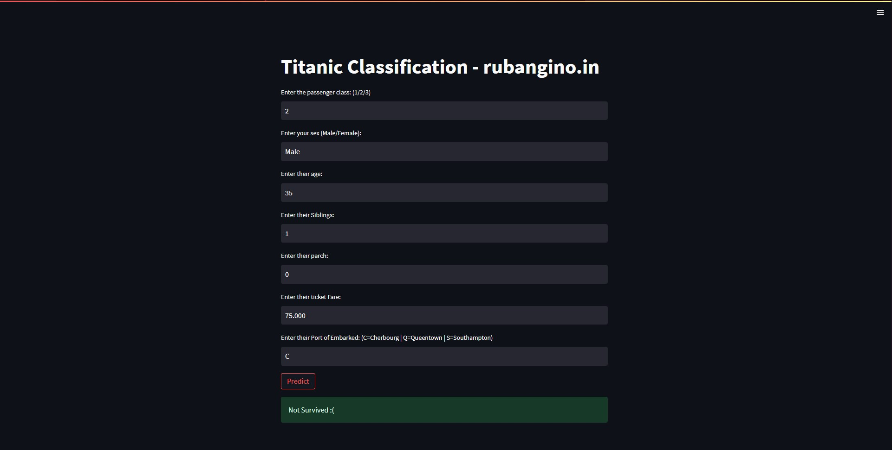

Here is the updated `README.md` with your information:

```markdown
<!-- To Bring back the link to the top--> 
<a name="readme-top"></a>

# 🚢 Titanic Classification 

[![Contributors][contributors-shield]][contributors-url]
[![Forks][forks-shield]][forks-url]
[![Stargazers][stars-shield]][stars-url]
[![Issues][issues-shield]][issues-url]
[![MIT License][license-shield]][license-url]
[![LinkedIn][linkedin-shield]][linkedin-url]
[![Twitter][twitter-shield]][twitter-url]

<!-- MARKDOWN LINKS & IMAGES -->
<!-- https://www.markdownguide.org/basic-syntax/#reference-style-links -->
[contributors-shield]: https://img.shields.io/github/contributors/D-mane07/Titanic-survival-prediction.svg?style=for-the-badge
[contributors-url]: https://github.com/D-mane07/Titanic-survival-prediction/graphs/contributors
[forks-shield]: https://img.shields.io/github/forks/D-mane07/Titanic-survival-prediction.svg?style=for-the-badge
[forks-url]: https://github.com/D-mane07/Titanic-survival-prediction/network/members
[stars-shield]: https://img.shields.io/github/stars/D-mane07/Titanic-survival-prediction.svg?style=for-the-badge
[stars-url]: https://github.com/D-mane07/Titanic-survival-prediction/stargazers
[issues-shield]: https://img.shields.io/github/issues/D-mane07/Titanic-survival-prediction.svg?style=for-the-badge
[issues-url]: https://github.com/D-mane07/Titanic-survival-prediction/issues
[license-shield]: https://img.shields.io/github/license/D-mane07/Titanic-survival-prediction.svg?style=for-the-badge
[license-url]: https://github.com/D-mane07/Titanic-survival-prediction/blob/main/LICENSE
[linkedin-shield]: https://img.shields.io/badge/-LinkedIn-black.svg?style=for-the-badge&logo=linkedin&colorB=555
[linkedin-url]: https://www.linkedin.com/in/dhanyakumar-mane
[twitter-shield]: https://img.shields.io/badge/X.com%20(Twitter)%20-black.svg?style=for-the-badge&logo=X&colorB=555
[twitter-url]: https://twitter.com/DhanyakumarMane

<!-- PROJECT LOGO -->
<br />
<div align="center">
  <a href="https://github.com/D-mane07/Titanic-survival-prediction/">
    
  </a>

  <h3 align="center">Titanic Survival Prediction | Titanic Classification</h3>

  <p align="center">
    A prediction of a passenger's survival in the Titanic based on various features such as age, gender, class, and more. 
    <br />
    <a href="https://github.com/D-mane07/Titanic-survival-prediction/blob/main/titanic.zip"><strong>Explore the project »</strong></a>
    <br />
    <br />
    <a href="https://github.com/D-mane07/Titanic-survival-prediction/issues">Report Bug</a>
    ·
    <a href="https://github.com/D-mane07/Titanic-survival-prediction/issues">Request Feature</a>
  </p>
</div>

<p align="center"> Welcome to the Titanic Classification project repository! This project aims to predict whether a passenger on the Titanic survived or not based on various features such as age, gender, class, and more. It serves as a classic introductory machine learning project for those interested in data science and predictive modeling. </p>

<!-- TABLE OF CONTENTS -->
<details>
  <summary>Table of Contents</summary>
  <ol>
    <li>
      <a href="#about-the-project-">About The Project</a>
      <ul>
        <li><a href="#project-workflow-">Project Workflow</a></li>
        <li><a href="#built-with-%EF%B8%8F">Built With</a></li>
      </ul>
    </li>
    <li>
      <a href="#getting-started-">Getting Started</a>
      <ul>
        <li><a href="#prerequisites-">Prerequisites</a></li>
        <li><a href="#installation-">Installation</a></li>
      </ul>
    </li>
    <li><a href="#usage-">Usage</a></li>
    <li><a href="#contributing-">Contributing</a></li>
    <li><a href="#license-">License</a></li>
    <li><a href="#acknowledgements-">Acknowledgments</a></li>
    <li><a href="#contact-%EF%B8%8F">Contact</a></li>
  </ol>
</details>

<!-- About the project-->
## About the Project 💻

[](assets/titanic-home-screenshot.jpg)

The sinking of the Titanic is one of the most infamous shipwrecks in history. On April 15, 1912, the Titanic sank after hitting an iceberg, resulting in the deaths of over 1,500 passengers and crew. This project attempts to predict whether a given passenger survived or not using machine learning algorithms. 

Key components of this project include: 

- Data preprocessing and cleaning.
- Exploratory Data Analysis (EDA) to gain insights into the dataset.
- Feature engineering to create meaningful features.
- Model selection and training.
- Model evaluation and performance metrics. 

<p align="right">(<a href="#readme-top">back to top</a>)</p>


<!--Built with Section--> 
## Project Workflow 📚

The project follows a structured workflow:

1. **Data Collection and Overview:** In this initial step, I gather the Titanic dataset, which contains information about passengers such as their age, gender, class, and whether they survived or not. We start by loading and inspecting the dataset to get a high-level understanding of its structure and content.

2. **Data Preprocessing and Cleaning:** Data preprocessing is crucial for preparing the dataset for modeling. This step involves handling missing values, dealing with outliers, and converting categorical variables into numerical format. Data cleaning ensures that the dataset is ready for analysis and modeling. 

3. **Exploratory Data Analysis (EDA):** EDA is an essential part of any data analysis project. It involves visualizing and understanding the dataset's characteristics, exploring relationships between variables, and identifying patterns or trends. EDA provides valuable insights that guide feature engineering and model selection.

4. **Feature Engineering:** Feature engineering focuses on creating new features or modifying existing ones to improve the predictive power of the model. In this project, we generate meaningful features from the dataset, which can include creating age groups, extracting titles from names, and encoding categorical variables.

5. **Model Selection and Training:** With the preprocessed dataset and engineered features, we proceed to select machine learning models for classification. We split the data into training and testing sets, train various models (e.g., logistic regression, decision trees, random forests), and evaluate their performance using metrics like accuracy, precision, recall, and F1-score.

6. **Model Evaluation and Performance Metrics:** This step involves a detailed evaluation of the selected models. We assess their performance on the test data and compare them using various evaluation metrics. Additionally, we may perform hyperparameter tuning to optimize the models.

7. **Conclusion and Results:** In the final step, we summarize the results of the classification models. We may provide insights into which features were most important for prediction and discuss the strengths and weaknesses of the chosen models. The conclusion provides an overall assessment of the project's success and any future directions for improvement.

<p align="right">(<a href="#readme-top">back to top</a>)</p>

## Built With 🖥️

[](https://github.com/D-mane07)
[](https://github.com/D-mane07)

[](https://github.com/D-mane07)
[](https://github.com/D-mane07)
[](https://github.com/D-mane07)
[](https://github.com/D-mane07)

[](https://github.com/D-mane07)

<p align="right">(<a href="#readme-top">back to top</a>)</p>

<!--Getting Started Section--> 
## Getting Started 🚀

Using this as an example, you may describe how to set up your project locally. Follow these easy simple steps to set up and operate a local copy.

### Prerequisites 📋

You must have Python installed on your machine in order to use this project. Python may be downloaded from [this page](https://www.python.org/downloads/) if you don't already have it installed.

### Installation 📋

1. Clone the repository to your local machine
```
git clone https://github.com/D-mane07/Titanic-survival-prediction.git
```

2. Change directory into the repository
```
cd Titanic-survival-prediction
```

3. Explore the notebooks in the repository using a Jupyter Notebook or JupyterLab environment. You can launch the environment by running the following command:
```
jupyter notebook
```
or
```
jupyter lab
```

<p align="right">(<a href="#readme-top">back to top</a>)</p>


<!--Usage-->
## Usage 📋

1. Run the Streamlit application with the given command:
```
streamlit run streamlitapi.py
```

2. Access the application in your web browser, input iris flower measurements, and receive predictions on the species.

<p align="right">(<a href="#readme-top">back to top</a>)</p>

<!--Contribution-->
## Contributing 🤝

Contributions to this repository are welcome! If you have any improvements, additional examples, or new topics you would like to add, please follow these steps:

1) Fork the repository in GitHub.
2) Create a new branch with a descriptive name for your changes.
3) Make your modifications, additions, or improvements.
4) Commit and push your changes to your forked repository.
5) Submit a pull request to the original repository.

Please ensure your contributions adhere to the coding style and guidelines used in the repository.

<p align="right">(<a href="#readme-top">back to top</a>)</p>

<!--Licence-->
## License 📄

This repository is licensed under the [MIT LICENSE](/LICENSE). You are free to use, modify, and distribute the code and content within this repository for personal or commercial purposes. However, please provide attribution to the original repository by linking back to it.

<p align="right">(<a href="#readme-top">back to top</
